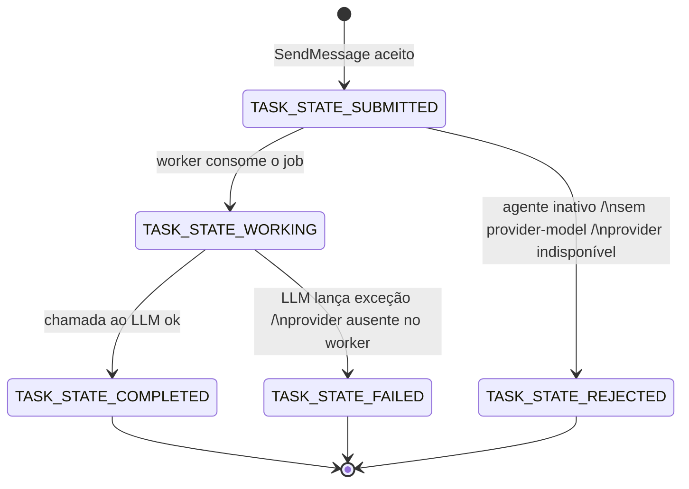
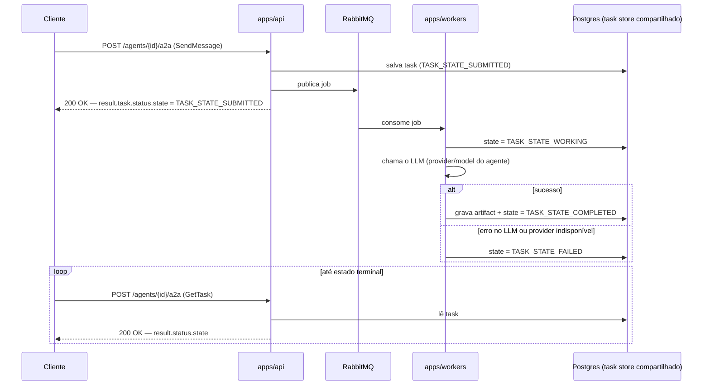

# Integração via A2A — guia para desenvolvedores

Este documento descreve como enviar mensagens para um agente cadastrado no
Buteco Agents e acompanhar o processamento até o resultado final, usando o
endpoint A2A exposto por `apps/api`.

**Pré-requisito**: você já precisa ter o `id` (GUID) de um agente cadastrado
e ativo — o cadastro/gestão de agentes (`POST /agents`, `GET /providers`,
ativar/desativar) não é coberto aqui.

## Índice

- [O endpoint](#o-endpoint)
- [A regra mais importante: erro não é HTTP 4xx/5xx](#a-regra-mais-importante-erro-não-é-http-4xx5xx)
- [Método `SendMessage`](#método-sendmessage)
- [Método `GetTask`](#método-gettask)
- [Onde está a resposta do agente](#onde-está-a-resposta-do-agente)
- [Enumeradores](#enumeradores)
- [Estados da Task e como tratar cada um](#estados-da-task-e-como-tratar-cada-um)
- [Diagramas de fluxo](#diagramas-de-fluxo)
- [Erros do protocolo](#erros-do-protocolo)
- [Recomendações de polling](#recomendações-de-polling)
- [Notas operacionais](#notas-operacionais)

## O endpoint

```
POST /agents/{id}/a2a
Content-Type: application/json
```

- `{id}` é o GUID do agente, atribuído no cadastro (`POST /agents`).
- Em desenvolvimento local, a porta padrão é `5017` (ver
  `apps/api/src/Buteco.Api/Properties/launchSettings.json`) — em outros
  ambientes, confirme a porta/host configurados.
- O corpo é sempre um envelope [JSON-RPC 2.0](https://www.jsonrpc.org/specification):

```json
{
  "jsonrpc": "2.0",
  "id": 1,
  "method": "SendMessage",
  "params": { }
}
```

Este endpoint implementa o protocolo [A2A](https://a2a-protocol.org/latest/)
na íntegra (é a SDK oficial `A2A.AspNetCore` quem expõe a rota), mas o
Buteco Agents só dá suporte real a dois métodos: **`SendMessage`** e
**`GetTask`**. Outros métodos do protocolo (streaming, cancelamento, listar
tasks, push notification) não fazem parte do contrato suportado — não use.

## A regra mais importante: erro não é HTTP 4xx/5xx

JSON-RPC responde **sempre HTTP 200**, mesmo quando a chamada falha — inclusive
para um `id` de agente que não existe. O sucesso ou erro está no corpo da
resposta, nunca no status HTTP:

```json
// sucesso
{ "jsonrpc": "2.0", "id": 1, "result": { } }

// erro
{ "jsonrpc": "2.0", "id": 1, "error": { "code": -32600, "message": "Agente '...' não encontrado." } }
```

**Sempre verifique a presença de `error` no corpo antes de olhar `result`.**
Checar apenas `response.ok`/status HTTP não detecta falha.

## Método `SendMessage`

Cria uma task para o agente processar. É assíncrono: a API responde assim
que a task é persistida e o job publicado na fila — **não espera o LLM
responder**.

### `params`

| Propriedade | Tipo | Obrigatório | Descrição |
| --- | --- | --- | --- |
| `message` | `Message` | Sim | A mensagem do usuário. Ver abaixo. |
| `configuration` | objeto | Não | Existe no protocolo (histórico, push notification, modos de saída aceitos), mas o Buteco Agents ignora — a task sempre roda de forma assíncrona e a config de push notification não tem efeito aqui. Omita. |
| `metadata` | objeto | Não | Repassado sem uso interno. |

### `message`

| Propriedade | Tipo | Obrigatório | Descrição |
| --- | --- | --- | --- |
| `role` | enum `Role` | Sim | Use sempre `"ROLE_USER"` — é o cliente enviando a mensagem. |
| `parts` | `Part[]` | Sim | Conteúdo da mensagem. Ver [Enumeradores](#enumeradores) — só `text` é processado hoje. |
| `messageId` | `string` | Sim | Identificador único da mensagem, gerado pelo cliente (ex.: um UUID). Não precisa ser o mesmo entre mensagens diferentes. |
| `contextId` | `string` | Não | Omita na primeira mensagem de uma conversa. Para continuar a mesma conversa (com histórico), reenvie o `contextId` retornado na task anterior — ver [Estados da Task](#estados-da-task-e-como-tratar-cada-um). |

### Exemplo de requisição

```bash
curl -X POST http://localhost:5017/agents/<agentId>/a2a \
  -H "Content-Type: application/json" \
  -d '{
    "jsonrpc": "2.0",
    "id": 1,
    "method": "SendMessage",
    "params": {
      "message": {
        "role": "ROLE_USER",
        "parts": [{ "text": "Olá, tudo bem?" }],
        "messageId": "b6f1e2b1-3e6b-4b8b-9b0e-2f6a2c9b7a10"
      }
    }
  }'
```

### Exemplo de resposta

```json
{
  "jsonrpc": "2.0",
  "id": 1,
  "result": {
    "task": {
      "id": "9f2c...",
      "contextId": "3a7d...",
      "status": { "state": "TASK_STATE_SUBMITTED", "timestamp": "2026-08-01T18:24:00Z" }
    }
  }
}
```

Guarde `result.task.id` (para consultar via `GetTask`) e
`result.task.contextId` (para continuar a conversa depois).

## Método `GetTask`

Consulta o estado atual de uma task — é a **única** forma de saber se o
agente já respondeu (não há streaming nem push notification). Chame
repetidamente até receber um estado terminal.

### `params`

| Propriedade | Tipo | Obrigatório | Descrição |
| --- | --- | --- | --- |
| `id` | `string` | Sim | O `taskId` retornado por `SendMessage`. |
| `historyLength` | `number` | Não | Limita quantas mensagens do histórico vêm em `result.history`. Omita para o comportamento padrão. |

### Exemplo de requisição

```bash
curl -X POST http://localhost:5017/agents/<agentId>/a2a \
  -H "Content-Type: application/json" \
  -d '{"jsonrpc":"2.0","id":2,"method":"GetTask","params":{"id":"<taskId>"}}'
```

### Exemplo de resposta (task concluída)

```json
{
  "jsonrpc": "2.0",
  "id": 2,
  "result": {
    "id": "9f2c...",
    "contextId": "3a7d...",
    "status": { "state": "TASK_STATE_COMPLETED", "timestamp": "2026-08-01T18:24:03Z" },
    "artifacts": [
      {
        "artifactId": "c1a0...",
        "parts": [{ "text": "Oi! Tudo ótimo, e você?" }]
      }
    ]
  }
}
```

## Onde está a resposta do agente

Ponto que costuma confundir quem vem de outras APIs: a resposta do agente
**não** fica em `status.message`. Ela fica em `artifacts[].parts[].text`.
`status.message` fica `null` tanto em `completed` quanto em `failed`/
`rejected` — o protocolo permite anexar uma mensagem ao status, mas o
Buteco Agents não usa esse campo hoje.

```
result.status.state       → TASK_STATE_COMPLETED / FAILED / ...
result.artifacts[0].parts[0].text  → o texto de resposta do agente
```

## Enumeradores

### `Role` (em `message.role`)

| Valor | Uso |
| --- | --- |
| `ROLE_USER` | Sempre o valor a enviar — é o papel do cliente. |
| `ROLE_AGENT` | Papel da resposta do agente nas mensagens de histórico (`result.history[]`). Não envie isso. |
| `ROLE_UNSPECIFIED` | Nunca use. |

### `Part` (em `message.parts[]`)

O protocolo A2A define três tipos de conteúdo para uma `Part` (texto,
arquivo, dado estruturado), mas **hoje o Buteco Agents só lê partes de
texto** ao montar a chamada para o LLM — partes de arquivo/dado são aceitas
pela rota (não geram erro), mas são ignoradas silenciosamente no
processamento. Envie sempre pelo menos uma part de texto:

```json
{ "text": "sua mensagem" }
```

### `TaskState` (em `status.state`, respostas)

O protocolo A2A define 9 estados possíveis. O Buteco Agents só produz **5**
deles — os outros existem na SDK mas nunca aparecem em uma resposta deste
sistema:

| Valor | Produzido pelo Buteco Agents? | Terminal? |
| --- | --- | --- |
| `TASK_STATE_SUBMITTED` | Sim | Não |
| `TASK_STATE_WORKING` | Sim | Não |
| `TASK_STATE_COMPLETED` | Sim | Sim |
| `TASK_STATE_FAILED` | Sim | Sim |
| `TASK_STATE_REJECTED` | Sim | Sim |
| `TASK_STATE_INPUT_REQUIRED` | Não | — |
| `TASK_STATE_AUTH_REQUIRED` | Não | — |
| `TASK_STATE_CANCELED` | Não | — |
| `TASK_STATE_UNSPECIFIED` | Não | — |

Trate os 4 estados "não produzidos" como não pertencentes ao contrato: não
construa lógica de cliente para lidar com eles.

## Estados da Task e como tratar cada um

| Estado | Terminal | O que significa | O que fazer |
| --- | --- | --- | --- |
| `TASK_STATE_SUBMITTED` | Não | Task persistida e job publicado na fila; nenhum worker pegou ainda. | Continuar consultando `GetTask`. |
| `TASK_STATE_WORKING` | Não | Um worker pegou o job e está chamando o LLM. | Continuar consultando `GetTask`. |
| `TASK_STATE_COMPLETED` | Sim | O LLM respondeu com sucesso. | Ler a resposta em `artifacts[].parts[].text`. Para continuar a conversa, reenvie `contextId` na próxima `SendMessage`. |
| `TASK_STATE_FAILED` | Sim | A chamada ao LLM lançou exceção, ou o provider do agente não está configurado no ambiente dos workers. | Parar de consultar. **Não há motivo estruturado disponível** — `status.message` é sempre `null` aqui; o detalhe do erro só existe nos logs do worker. Trate como falha genérica (ex.: oferecer nova tentativa como uma nova task). |
| `TASK_STATE_REJECTED` | Sim | A task nunca chegou a um worker — rejeitada na hora do `SendMessage`. Três causas possíveis, indistinguíveis por essa resposta: agente inativo (`isActive = false`), agente sem `provider`/`model` configurados, ou o `provider` do agente não está mais configurado no ambiente da API. | Parar de consultar. Se precisar saber qual das três causas foi, consulte `GET /agents/{id}` separadamente e compare `isActive`/`provider`/`model`. |
| *(nenhuma transição chega)* | — | Caso raro: falha de infraestrutura no worker fora do tratamento normal (ex.: banco indisponível ao carregar o job) faz a mensagem ser descartada sem reentrega e sem a task nunca virar `failed`. | O cliente precisa impor seu próprio timeout de polling — não assuma que todo `submitted`/`working` eventualmente termina. |

**Sobre `contextId` e conversas com múltiplos turnos**: reenviar o mesmo
`contextId` em `SendMessage` faz o worker recuperar as mensagens da task
`completed` anterior nesse contexto e incluí-las como histórico na chamada
ao LLM (limitado às últimas 20 mensagens). Tasks `failed`/`rejected` nunca
entram nesse histórico. Um `contextId` novo (ou omitido) começa uma
conversa sem memória anterior.

## Diagramas de fluxo

### Ciclo de vida da Task



### Sequência completa (SendMessage + polling via GetTask)



## Erros do protocolo

Erros vêm no formato JSON-RPC padrão:

```json
{ "jsonrpc": "2.0", "id": 1, "error": { "code": -32600, "message": "texto livre" } }
```

- `code` é um código de erro estável do protocolo A2A/JSON-RPC (ex.: `-32600`
  para requisição inválida — inclui `{id}` de agente inexistente na rota;
  `-32001` para task não encontrada em `GetTask`). Programe sua lógica de
  branch em cima de `code`.
- `message` é texto livre **em português**, pensado para log/debug — não é
  um contrato estável, não faça parsing dele.

## Recomendações de polling

Não há streaming nem push notification neste endpoint hoje — `GetTask` por
polling é o único jeito de saber que uma task terminou. Sugestão:

- Intervalo entre consultas: algo como 1 segundo é razoável para respostas
  de LLM (a resposta raramente sai em menos que isso).
- **Sempre defina um timeout no cliente** (ex.: parar de tentar depois de
  30–60s) — como visto acima, existe um caso em que a task nunca sai de
  `submitted`/`working`.
- Pare de consultar assim que `status.state` for um dos três estados
  terminais (`completed`, `failed`, `rejected`).

## Notas operacionais

- **Sem autenticação**: nem o cadastro de agentes nem a rota A2A de nenhum
  agente exigem credencial hoje. Trate isso como o estado atual do
  ambiente, não como algo a contornar no cliente.
- **Idioma das mensagens de erro**: `error.message` é sempre pt-BR — não
  internacionalizado.
